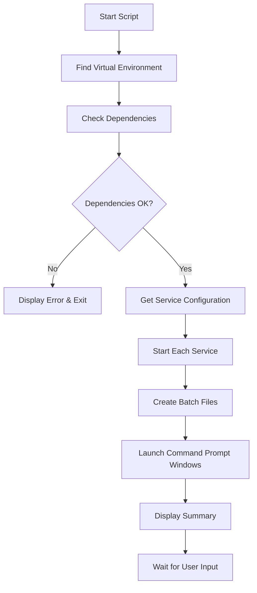

# How Start Service Works

## Overview

The `start_services.py` script is a comprehensive service launcher for the Jeeves4Service monorepo. It automatically starts both the User Service and Property Service in independent Command Prompt windows, using the virtual environment configured at the root level.

## Architecture & Flow

### 1. Script Initialization
```
start_services.py execution begins
    ↓
Imports required modules
    ↓
Defines helper functions
    ↓
Calls main() function
```

### 2. Main Execution Flow



## Core Functions

### 1. `find_virtual_env()`
**Purpose**: Locates the Python virtual environment at the root level.

**Process**:
- Searches for common virtual environment directory names: `venv`, `.venv`, `env`, `.env`
- Checks for `Scripts/python.exe` within each directory
- Returns the full path to the Python executable
- Falls back to system Python if no virtual environment is found

**Code Flow**:
```python
root_dir = Path(__file__).parent
for venv_name in ['venv', '.venv', 'env', '.env']:
    venv_path = root_dir / venv_name
    if venv_path.exists():
        python_exe = venv_path / 'Scripts' / 'python.exe'
        if python_exe.exists():
            return str(python_exe)
```

### 2. `get_service_info()`
**Purpose**: Defines configuration for all services to be started.

**Returns**: List of service dictionaries containing:
- `name`: Human-readable service name
- `module`: Python module path for uvicorn
- `port`: Port number for the service
- `log_file`: Log file name
- `docs_url`: Swagger documentation URL

**Configuration**:
```python
[
    {
        'name': 'User Service',
        'module': 'services.user_service.main:app',
        'port': 8000,
        'log_file': 'user_service.log',
        'docs_url': 'http://localhost:8000/docs'
    },
    {
        'name': 'Property Service',
        'module': 'services.property_service.main:app',
        'port': 8001,
        'log_file': 'property_service.log',
        'docs_url': 'http://localhost:8001/docs'
    }
]
```

### 3. `check_dependencies()`
**Purpose**: Validates that required dependencies are installed in the virtual environment.

**Process**:
- Uses the found Python executable
- Attempts to import `uvicorn`
- Returns `True` if successful, `False` otherwise
- Provides helpful error messages for missing dependencies

**Implementation**:
```python
result = subprocess.run([
    python_exe, '-c', 'import uvicorn; print("uvicorn available")'
], capture_output=True, text=True, timeout=10)
```

### 4. `start_service_in_new_console()`
**Purpose**: Launches each service in a separate Command Prompt window.

**Process**:
1. **Command Construction**: Creates the uvicorn command string with proper quoting
2. **Batch File Creation**: Generates a temporary batch file with startup commands
3. **Window Launch**: Uses `subprocess.Popen` to start a new Command Prompt
4. **Console Configuration**: Sets window title and displays service information

**Batch File Content**:
```batch
@echo off
cd /d "D:\MyData\MyWork\_Github\Jeeves4Service"
title User Service
echo Starting User Service...
echo Service will be available at: http://localhost:8000
echo API Documentation: http://localhost:8000/docs
echo Log file: user_service.log
echo.
echo Running command: "path\to\python.exe" -m uvicorn services.user_service.main:app --host 0.0.0.0 --port 8000 --reload --log-level info
echo.
"path\to\python.exe" -m uvicorn services.user_service.main:app --host 0.0.0.0 --port 8000 --reload --log-level info
echo.
echo User Service has stopped.
pause
```

**Command Execution**:
```python
subprocess.Popen([
    'cmd', '/c', 'start', 'cmd', '/k', batch_file_path
], cwd=root_dir)
```

### 5. `main()`
**Purpose**: Orchestrates the entire startup process.

**Process**:
1. **Display Header**: Shows startup banner
2. **Environment Setup**: Finds working directory and Python executable
3. **Dependency Validation**: Checks required packages
4. **Service Launch**: Starts each configured service
5. **Summary Display**: Shows started services and access URLs
6. **User Interaction**: Waits for user confirmation before exit

## Technical Details

### Virtual Environment Detection
The script searches for virtual environments in this order:
1. `venv/Scripts/python.exe`
2. `.venv/Scripts/python.exe`
3. `env/Scripts/python.exe`
4. `.env/Scripts/python.exe`

### Command Prompt Window Management
- Each service gets its own dedicated Command Prompt window
- Windows have descriptive titles (e.g., "User Service", "Property Service")
- Windows remain open after service stops (due to `pause` command)
- Services can be stopped by closing the window or pressing Ctrl+C

### Error Handling
- **Dependency Errors**: Clear messages about missing packages
- **Startup Errors**: Individual service failures don't stop other services
- **Keyboard Interruption**: Graceful handling of Ctrl+C
- **Unexpected Errors**: Generic error handling with user feedback

### Uvicorn Configuration
Each service is started with these uvicorn parameters:
- `--host 0.0.0.0`: Accept connections from any IP
- `--port [8000|8001]`: Service-specific port
- `--reload`: Auto-restart on code changes (development mode)
- `--log-level info`: Informational logging level

## Usage Scenarios

### Development Workflow
1. Developer runs `python start_services.py` from VS Code terminal
2. Both services start in separate windows
3. Developer can monitor each service independently
4. Code changes trigger automatic reloads
5. Services continue running even if VS Code is closed

### Production Considerations
For production deployment, consider:
- Removing `--reload` flag
- Adding proper logging configuration
- Using process managers like supervisor or systemd
- Implementing health checks and monitoring

## File Dependencies

### Required Files
- `services/user_service/main.py`: User service FastAPI application
- `services/property_service/main.py`: Property service FastAPI application
- `requirements.txt`: Python dependencies
- Virtual environment at root level

### Generated Files
- Temporary batch files (auto-cleaned by OS)
- Service log files (as configured in each service)

## Troubleshooting

### Common Issues

1. **"No virtual environment found"**
   - Ensure virtual environment exists at root level
   - Check virtual environment names match expected patterns

2. **"uvicorn is not installed"**
   - Run: `pip install -r requirements.txt`
   - Ensure virtual environment is activated

3. **"Filename, directory name, or volume label syntax is incorrect"**
   - Usually caused by path quoting issues (fixed in current version)
   - Ensure no special characters in project path

4. **Services fail to start**
   - Check port availability (8000, 8001)
   - Verify service module paths are correct
   - Check for syntax errors in service code

### Debug Steps
1. Run script from VS Code terminal to see error messages
2. Check individual service console windows for detailed errors
3. Verify virtual environment activation: `python --version`
4. Test uvicorn manually: `python -m uvicorn services.user_service.main:app --port 8000`

## Future Enhancements

### Potential Improvements
1. **Configuration File**: External config for ports and service settings
2. **Health Checks**: Verify services are responding before declaring success
3. **Service Discovery**: Automatic detection of services in the monorepo
4. **Logging Integration**: Centralized logging configuration
5. **Docker Support**: Option to run services in containers
6. **Load Balancer**: Integration with reverse proxy configuration

### Extensibility
The script is designed to be easily extended:
- Add new services by updating `get_service_info()`
- Modify uvicorn parameters in `start_service_in_new_console()`
- Add environment-specific configurations
- Integrate with CI/CD pipelines

## Security Considerations

### Current Implementation
- Uses local virtual environment
- Services bind to all interfaces (0.0.0.0)
- No authentication in startup process
- Temporary batch files contain command lines

### Recommendations
- Consider binding to localhost only for development
- Implement proper secret management for production
- Add startup authentication for sensitive environments
- Clean up temporary files explicitly if needed

---

**Note**: This documentation covers the current implementation as of the latest version. Always refer to the actual code for the most up-to-date behavior.
